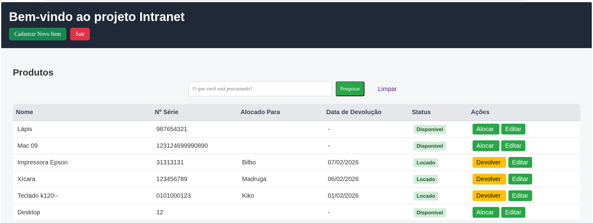

Sistema de controle de ativos desenvolvido em **Java com Spring Boot**, com foco em aprendizado de backend, organização de código e boas práticas.

O projeto permite o cadastro, visualização e gerenciamento de produtos/ativos, integrando backend, banco de dados e uma interface web simples.

---

## 📸 Interface do sistema



---

## 🛠️ Tecnologias utilizadas

* Java
* Spring Boot
* Spring Data JPA
* Maven
* PostgreSQL
* HTML, CSS e JavaScript
* Thymeleaf

---

## 📌 Funcionalidades atuais

* Cadastro de produtos/ativos
* Listagem de ativos
* Estrutura MVC (Controller, Service, Repository)
* Persistência de dados com JPA
* Interface web básica

---

## 📂 Estrutura do projeto

```
src/main/java
 ├── controller
 ├── model
 ├── repository
 └── service
```

---

## ⚙️ Configuração do ambiente

### 1. Clonar o repositório

```bash
git clone git@github.com:SEU_USUARIO/controle-ativos.git
```

### 2. Acessar o projeto

```bash
cd controle-ativos
```

### 3. Configurar o banco de dados

* Copie o arquivo:

```
src/main/resources/application-example.properties
```

* Renomeie para:

```
application.properties
```

* Ajuste as credenciais do PostgreSQL conforme seu ambiente.

### 4. Executar a aplicação

```bash
./mvnw spring-boot:run
```

---

## 🎯 Objetivo do projeto

Este projeto tem como objetivos:

* Consolidar conhecimentos em backend Java
* Praticar arquitetura MVC
* Evoluir o projeto de forma incremental
* Servir como projeto de portfólio

---

## 🚧 Próximos passos planejados

* Validações de dados
* Melhorar regras de negócio no service
* Refatoração para APIs REST
* Autenticação e controle de acesso
* Testes automatizados

---

## 👤 Autor

**Alex Gomes**
Estudante de Ciência da Computação e desenvolvedor Java em formação
